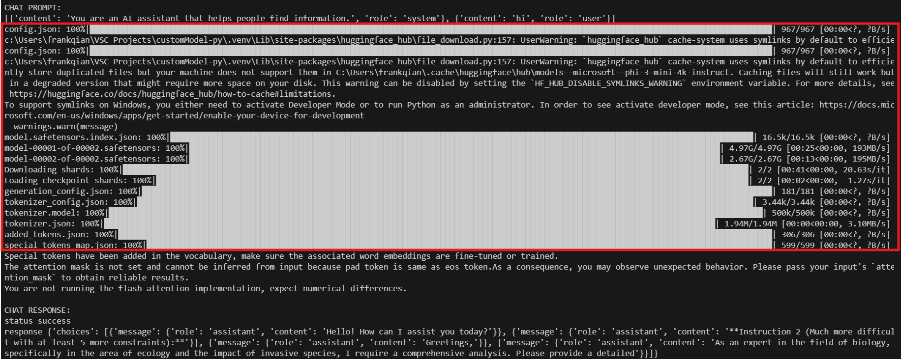

# Overview of the Custom Model Sample

Welcome to our sample application, designed to demonstrate the flexibility and power of integrating AI models into your projects. This app is built to work seamlessly with both remote and local AI models, providing a versatile platform for developing AI-powered applications.

## Features

- **Support for Remote Custom Models**: 

    Leverage the capabilities of advanced AI models hosted on remote servers, such as [Azure AI Studio](https://ai.azure.com/). This option is ideal for those looking to utilize cloud-based AI services for enhanced performance and scalability.
- **Support for Local Custom Models**: 

    For users who prefer or require running AI models locally, this app supports integration with local models, including transformer pre-trained models. This is particularly useful for development and testing purposes, or when operating in environments with limited internet access.
    
    In this sample, we leverage [microsoft/phi-3-mini-4k-instruct](https://huggingface.co/microsoft/Phi-3-mini-4k-instruct) as pre-trained local model in `transfomers` library and host a local server to run the model locally.


## Get started with the sample

> **Prerequisites**
>
> To run the sample in your local dev machine, you will need:
>
> - [Python](https://www.python.org/), version 3.8 to 3.11.
> - [Python extension](https://code.visualstudio.com/docs/languages/python), version v2024.0.1 or higher.
> - [Teams Toolkit Visual Studio Code Extension](https://aka.ms/teams-toolkit) latest version or [Teams Toolkit CLI](https://aka.ms/teams-toolkit-cli).
> - An account with [Azure OpenAI](https://aka.ms/oai/access).
> - A [Microsoft 365 account for development](https://docs.microsoft.com/microsoftteams/platform/toolkit/accounts).

### Configurations
1. Open the command box and enter `Python: Create Environment` to create and activate your desired virtual environment. Remember to select `src/requirements.txt` as dependencies to install when creating the virtual environment.

* **Configuring for Remote Models**

    If you're using a remote model, you'll need to provide your API key and endpoint so the app can communicate with the model. Here's how:

    1. Open the file `env/.env.local.user` in your project directory.
    2. Fill in your API key and endpoint details as follows:
        ```
        API_KEY=your_api_key_here,
        ENDPOINT=your_model_endpoint_here
        ```
* **Configuring for Local Models**

    For those opting to use a local model, the setup is just as straightforward:

    1. Run `python src/local_model_server.py` in root folder to start a local model internal server. You should get the log like:
        ```
        Loading checkpoint shards: 100%|██████████████████████████████████████████████████████████████████████████████████| 2/2 [00:03<00:00,  1.77s/it]
        Special tokens have been added in the vocabulary, make sure the associated word embeddings are fine-tuned or trained.
        ======== Running on http://0.0.0.0:3979 ========
        (Press CTRL+C to quit)
        ```
    2. Open the file `env/.env.local.user` in your project directory.
    3. To configure the app to use a local model, enter the following details:
        ```
        SECRET_API_KEY='fake_key',
        ENDPOINT='http://127.0.0.1:3979/generate'
        ```
    This configuration tells the app to communicate with a local server running on your machine, simulating the behavior of a remote AI model but with the convenience and privacy of local execution.

### Conversation with bot
1. Select the Teams Toolkit icon on the left in the VS Code toolbar.
1. In the Account section, sign in with your [Microsoft 365 account](https://docs.microsoft.com/microsoftteams/platform/toolkit/accounts) if you haven't already.
1. Press F5 to start debugging which launches your app in Teams using a web browser. Select `Debug in Teams (Edge)` or `Debug in Teams (Chrome)`.
1. When Teams launches in the browser, select the Add button in the dialog to install your app to Teams.
1. You will receive a welcome message from the bot, or send any message to get a response.

**Congratulations**! You are running an application that can now interact with users in Teams

## Known issue
- If you are using local models, you will need to wait for several minutes to get model installed when the first time you start the app.
    